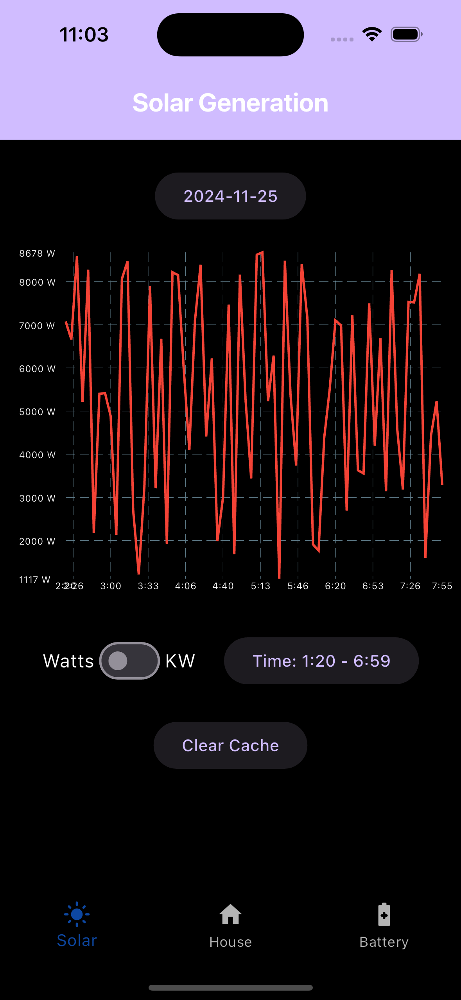
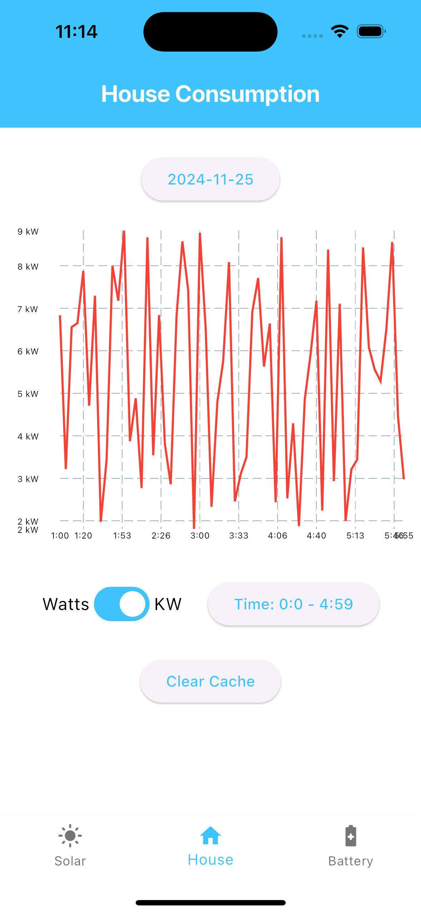
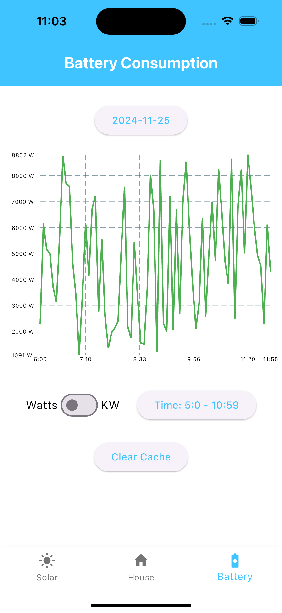

# **Solar Monitoring App**

A Flutter application for monitoring solar energy generation, house energy consumption, and battery usage, with features like caching, data visualization, and offline support.

---

## **Features**
- 📈 **Interactive Charts**: Beautiful line charts for data visualization using `fl_chart`.
- 🔄 **Pull-to-Refresh**: Refresh data with a simple swipe gesture.
- 📅 **Date Selector**: Easily pick a date to view specific data points.
- 📥 **Offline Support**: Cache data for offline viewing using `shared_preferences`.
- 🧭 **Bottom Navigation**: Seamlessly switch between monitoring tabs.
- 💡 **Theming**: Supports light and dark themes.

---

## **Screenshots**

| Solar Generation                | House Consumption               | Battery Usage                       |
|---------------------------------|---------------------------------|-------------------------------------|
|  |  |  |

---

## **Getting Started**

### **Prerequisites**
1. Install [Flutter](https://flutter.dev/docs/get-started/install) (version 3.0 or above).
2. Ensure you have a device or emulator set up for development.


### **Installation**

    1. Clone the repository:

   ```bash
   git clone https://github.com/wissa-azmy/solar-monitoring-app.git
   cd solar-monitoring-app
   ```

    2.  The API for this app is provided as a dockerized application; Unzip the 'Take Home Challenge Resources.zip' file.
    4.  In the solar-monitor-api/ directory, build and run the API with Docker using the following commands:

```bash
cd solar-monitor-api/
docker build -t solar-monitor-api . 
docker run -p 3000:3000 solar-monitor-api
```

    5. Cd into the solar_monitoring_app directory and run the following commands:

```bash
flutter pub get
flutter run
```

## **How It Works**

### **Architecture**

	•	State Management: Using Bloc for managing app states.
	•	Caching: Data is cached locally using shared_preferences for offline viewing.
	•	Dynamic Navigation: BottomNavigationBar allows switching between views while reusing widgets.

### **Data Flow**

	1.	Fetches solar data, house consumption, and battery data from the API.
	2.	Caches data for offline support.
	3.	Displays the data using fl_chart for intuitive visualization.

### **Folder Structure**

```
lib/
├── data/                      # Data Layer
│   ├── common/                  # Data Layer shared resources
│   ├── DTOs/                    # Data Transfer Objects (e.g., SolarDataDto)
│   ├── repositories/            # Repositories responsible for Choosing the right data source (e.g. Cache or API) and mapping to and from Domain Model & Dtos
│   └── services/                # Services for API and caching
│
├── domain/                    # Domain Layer
│   ├── common/                  # Domain Layer shared resources
│   ├── models/                  # Domain models (e.g., SolarDataModel)
│   ├── repositories_protocols/  # Repositories protocols to invert the dependency of the domain layer to the data layer
│   └── use_cases/
│
├── presentation/             # Presentation Layer
│   ├── common/                 # Shared UI resources
│   │   ├── design/             # App theme, sizes & etc.
│   │   ├── state_management/   # State management logic (BaseCubit, BaseState & AppBlocObserver)
│   │   ├── strings/            # Localization strings
│   │   └── widgets/            # Reusable widgets
│   └── screens/                # App screens (e.g., SolarGenerationScreen)
│
├── dependencies/                  # Dependency Management
│
└── main.dart                   # App entry point
```


### **Dependencies**

| Dependency         | Description                                           |
|--------------------|-------------------------------------------------------|
| flutter_bloc       | State management with Bloc.                           |
| fl_chart           | Interactive and beautiful charting library.           |
| shared_preferences | Local storage for caching data.                       |
| intl               | For date formatting.                                  |
| http               | For making http requests.                             |
| equatable          | To Simplify Equality Comparisons.                     |
| logger             | To prints beautiful/readable logs.                    |
| mockito            | To create Mocks, behavior verification, and stubbing. |
| build_runner       | For Dart code generation.                             |

